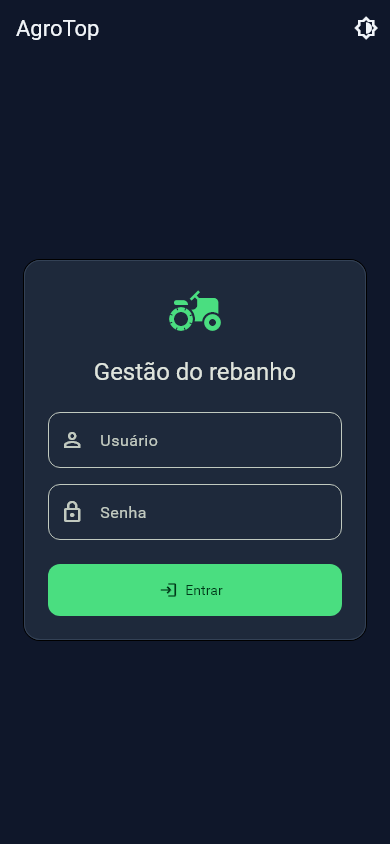
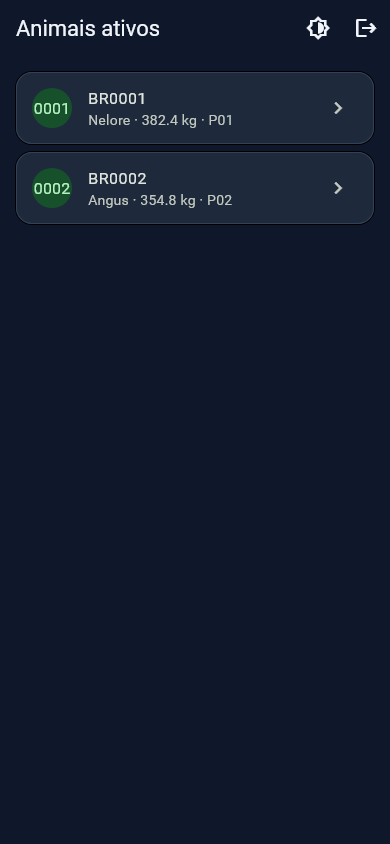
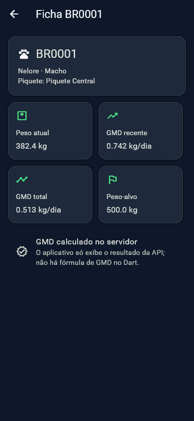

# PoC Flutter + API autenticada

**O caminho se sustenta: Flutter → FastAPI → regras e repositórios existentes funcionou
de ponta a ponta; para uma API pequena sempre disponível, estime US$ 5/mês no Railway
Hobby (ou US$ 7/mês no Render Starter), sem contar o PostgreSQL já usado pelo AgroTop.**

Validação feita em 1º de agosto de 2026. A PoC usa somente SQLite local e se recusa a
iniciar sem `AGROTOP_FORCE_SQLITE=1`; liberar PostgreSQL e produção é integração posterior,
fora deste escopo.

## Resultado funcional

O fluxo real executado foi:

1. o cliente Dart usado pelo app enviou usuário e senha a `POST /auth/login`;
2. a API leu `users` e validou o PBKDF2 com `services.seguranca`;
3. o cliente guardou e reapresentou o JWT;
4. `GET /animais` devolveu os 12 animais ativos criados por `init_db()`;
5. `GET /animais/BR0001` devolveu a ficha com GMD recente `0,599 kg/dia` e GMD total
   `0,594 kg/dia`.

Saída observada:

```text
login=admin; animais=12; ficha=BR0001; gmd_recente=0.599; gmd_total=0.594
POST /auth/login 200
GET /animais 200
GET /animais/BR0001 200
```

Não há fórmula de GMD no Dart. A API chama
`repositories.pesagens.calculate_gmd` (a mesma função usada pelo web) e
`services.zootecnia.calculate_gmd_total`. Se a API falha, o app mostra erro e não injeta
dados fictícios.

## Capturas do fluxo

As capturas são geradas pelo teste de widgets, com as respostas HTTP determinísticas que
exercitam o mesmo `ApiClient` do aplicativo. A autenticação e os dados reais foram validados
separadamente no fluxo vivo descrito acima.

| Login | Animais do banco | Ficha e GMD do servidor |
|---|---|---|
|  |  |  |

## Custo de hospedar a API

| Provedor | Gratuito | Dorme? | Menor opção paga útil | Leitura para o AgroTop |
|---|---|---|---|---|
| Render | Sim, 750 horas/mês | Sim: após 15 min sem tráfego; retorno leva cerca de 1 min | Starter, US$ 7/mês, 512 MB | Gratuito serve à demonstração, mas o cold start é ruim para app de campo. Starter é simples e previsível. |
| Fly.io | Só teste: 2 horas de VM ou 7 dias | No teste, cada máquina para após 5 min; depois há auto-stop configurável | Pay-as-you-go: a tabela oficial parte de US$ 2,02/mês (256 MB) ou US$ 3,32/mês (512 MB), antes de extras | Mais barato e flexível, mas exige cartão e mais operação via CLI. |
| Railway | Sim: US$ 1 de crédito/mês | Opcional: Serverless dorme após 10 min sem tráfego de saída e acorda na próxima requisição | Hobby, US$ 5/mês incluindo US$ 5 de uso | Melhor equilíbrio para a primeira versão: deploy simples, limite de gasto e custo baixo. Desative Serverless se cold start for inaceitável. |

Fontes oficiais: [Render gratuito](https://render.com/docs/free),
[Render Starter](https://render.com/articles/top-heroku-alternatives-agencies),
[Fly.io preços](https://fly.io/docs/about/pricing/),
[Fly.io teste gratuito](https://fly.io/docs/about/free-trial/),
[Railway planos](https://docs.railway.com/pricing/plans) e
[Railway Serverless](https://docs.railway.com/deployments/serverless).

## Android: o workflow arquivado ainda funciona?

**Não sem atualização.** A ideia do workflow continua válida, mas o arquivo arquivado:

- procura o diretório removido `agrotop_mobile`, não `poc/mobile`;
- fixa Flutter 3.19.6, enquanto a PoC foi criada e validada em Flutter 3.44.8;
- usa `actions/checkout@v4` e `actions/setup-java@v4`, anteriores à migração para Node 24;
- usa `actions/upload-artifact@v4`, embora a versão corrente seja v7.

`mobile/build_apk.yml` contém a versão corrigida: Java 17, Flutter 3.44.8, análise, testes,
APK debug e upload do artefato. O build validado gera
`build/app/outputs/flutter-apk/app-debug.apk`.

## iOS

- Compilar, assinar e publicar exige macOS com Xcode; Windows/Linux não produzem o binário
  iOS final.
- Testes pessoais em aparelho são possíveis com Conta Apple gratuita, mas os perfis
  expiram em 7 dias.
- Distribuição por App Store, TestFlight, ad hoc ou Apple Business Manager exige o Apple
  Developer Program: **US$ 99/ano**, além de certificados/perfis administrados no Xcode e
  App Store Connect.

Fonte: [Apple — tipos de assinatura](https://developer.apple.com/br/support/compare-memberships/).

## Token no dispositivo

O JWT expira em **8 horas**, duração aproximada de um turno. Ele fica em
`flutter_secure_storage`, que usa armazenamento criptografado do Android e Keychain no
ecossistema Apple; a preferência de tema, que não é segredo, fica em
`shared_preferences`. Produção deve usar somente HTTPS. A documentação do pacote registra
Android API 23 como mínimo para a criptografia básica:
[flutter_secure_storage](https://pub.dev/packages/flutter_secure_storage).

## Veredito

**Seguir com ressalvas.** A fronteira arquitetural está provada e não cria um segundo
modelo de identidade: o app usa a tabela `users` própria e a API reaproveita o Python
existente. Antes de produção ainda faltam rate limiting, revogação/renovação de token,
HTTPS obrigatório, configuração PostgreSQL, autorização por tenant e pipeline de release
assinado. Esses itens são integração e endurecimento, não pertencem à PoC.
