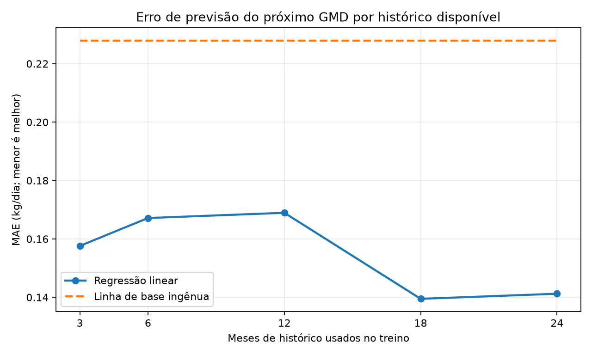

# PoC — histórico necessário para prever GMD

> **Resposta:** nesta simulação sintética, a regressão supera a linha de base ingênua
> **a partir de 3 meses** de coleta em **0,070 kg/dia** (MAE de 0,158 contra
> 0,228 kg/dia). Isso não basta para declarar o modelo pronto: **12 meses contínuos**
> são o mínimo recomendado para um piloto que tenha visto um ciclo sazonal completo,
> e **18 meses** produziram o menor erro desta simulação (0,139 kg/dia).

## Decisão e datas

Os resultados são uma **estimativa sob premissas sintéticas**, não evidência sobre o
rebanho real. Se a coleta consistente começar em **agosto de 2026**:

- **novembro de 2026 (3 meses):** já há volume para um protótipo técnico e para testar
  se ele vence a previsão ingênua, mas não para uma decisão de produção;
- **agosto de 2027 (12 meses):** primeira data defensável para backtest sazonal e piloto
  controlado de previsão do próximo GMD;
- **fevereiro de 2028 (18 meses):** ponto que apresentou o menor erro sintético;
- **agosto de 2028 (24 meses):** primeira janela razoável para começar a avaliar modelos
  de resultado econômico/carcaça, desde que existam ciclos completos com desfecho.

O limiar de 3 meses responde à comparação pedida com a baseline. A recomendação de
12 meses responde a uma pergunta diferente e operacional: quando já houve seca e chuva
suficientes para avaliar se o ganho não veio de uma estação específica.

## Resultado da curva de aprendizado

O erro é MAE em kg/dia para o GMD do próximo intervalo. Menor é melhor. O teste é o
mesmo período final de 180 dias em todas as janelas; apenas a quantidade de histórico de
treino muda.

| Histórico | Amostras de treino | Amostras de teste | Regressão | Ingênua | Ganho sobre a ingênua |
|---:|---:|---:|---:|---:|---:|
| 3 meses | 399 | 812 | 0,158 | 0,228 | 0,070 kg/dia |
| 6 meses | 813 | 812 | 0,167 | 0,228 | 0,061 kg/dia |
| 12 meses | 1.619 | 812 | 0,169 | 0,228 | 0,059 kg/dia |
| 18 meses | 2.434 | 812 | **0,139** | 0,228 | **0,088 kg/dia** |
| 24 meses | 2.932 | 812 | 0,141 | 0,228 | 0,087 kg/dia |



A curva não é monotônica. Acrescentar dados antigos pode introduzir outra distribuição
sazonal e não garante melhora automática; por isso 6 e 12 meses ficaram ligeiramente
piores que 3 meses. A queda em 18 meses mostra o benefício de observar mais de um ciclo
de seca/chuva. Essa oscilação é mais um motivo para não transformar o primeiro ponto que
vence a baseline em autorização de produção.

## Como a simulação foi construída

`gerar_dados.py` usa semente fixa (`20260731`) e gera:

- 200 animais, sem usar os 12 animais fictícios do banco;
- 30 meses e 4.144 pesagens, com intervalos aleatórios de 35 a 55 dias;
- peso inicial com média próxima de 275 kg e variação individual;
- GMD influenciado por estação, piquete, indivíduo e maturidade/peso;
- rotação semestral entre quatro piquetes;
- variação temporal autocorrelacionada;
- ruído de balança de 3,5 kg e 10% de medidas estimadas com ruído de 9 kg.

Essas premissas tornam os números plausíveis, mas não verdadeiros. Principalmente, a
força da sazonalidade e dos efeitos de piquete foi definida pelo simulador; o rebanho real
pode ter relações mais fracas, mais fortes ou diferentes.

## Modelo e prevenção de vazamento

O alvo é o GMD observado no intervalo seguinte. As features disponíveis no momento da
previsão são GMD atual, peso, idade, estação do ano, método da pesagem e piquete. O modelo
é regressão linear por mínimos quadrados, sem biblioteca de ML.

Para cada janela, o treino contém apenas alvos anteriores ao início do teste. Os 180 dias
finais ficam fora do ajuste. A baseline ingênua prevê que o próximo GMD será igual ao GMD
atual. Amostras com GMD fora da faixa −1 a 3 kg/dia são excluídas como provável erro de
medição.

Limitações:

- uma única fazenda sintética e uma única semente;
- os mesmos animais aparecem antes e depois do corte temporal, embora `animal_id` não
  seja feature;
- não mede generalização para outra fazenda ou outro sistema de manejo;
- não inclui consumo real, qualidade de pasto, temperatura, doença ou genética;
- não estima peso de carcaça, receita ou margem.

## Auditoria de prontidão do schema atual

Foram lidos `docs/schema-nuvem.txt` e o DDL de `init_db()`; nenhum banco foi acessado.

| Necessidade | Estado atual | Avaliação |
|---|---|---|
| Série de peso | `weighings.weight`, `weigh_date`, `animal_id` | **Disponível.** É a base do alvo de GMD. |
| Piquete na data | `weighings.lote_id` | **Disponível.** Não depende apenas do lote atual. |
| Peso atual | `animals.current_weight` | **Disponível**, sem substituir o histórico. |
| Método da medida | `weighings.method` | **Disponível.** Permite separar pesado de estimado. |
| Idade e entrada | `birth_date`, `birth_estimated`, `entry_date`, `entry_weight` | **Disponível**, com a incerteza de nascimento explicitada. |
| Lotação/manejo | `animal_movements` e `lotes.capacity_ua` | **Parcial.** Permite reconstruir presença; falta snapshot periódico de forragem/lotação efetiva. |
| Chuva | `pluviometria` por data e lote | **Disponível**, mas não há temperatura, umidade ou índice de estresse térmico. |
| Nutrição | `feeding_plans`, `feeding_checks.actual_quantity`, `insumo_transactions` | **Parcial.** Há trato por lote, não ingestão individual nem composição nutricional/matéria seca. |
| Custos | `animal_costs`, `fixed_costs`, `insumo_transactions` | **Parcial.** Falta regra temporal estável de rateio dos custos de lote/fazenda por animal. |
| Venda | `sales.weight_kg`, `total_value`, `cost_at_sale`, `profit` | **Parcial.** Há desfecho comercial, mas não peso quente de carcaça, rendimento medido e classificação frigorífica. |
| Pastagem | nenhuma série de biomassa, qualidade ou NDVI | **Ausente.** É uma feature futura prioritária. |

### O que precisa começar a ser registrado

1. Peso de carcaça quente, rendimento medido e classificação por animal vendido.
2. Quantidade efetivamente fornecida por lote/dia, matéria seca e composição da dieta.
3. Biomassa/altura e qualidade da forragem por piquete; NDVI quando a Trilha 4 estiver
   validada.
4. Temperatura e umidade diárias para derivar estresse térmico, além da chuva já existente.
5. Regra auditável de apropriação de custo de trato e custo fixo por animal e período.
6. Motivo de ausência/irregularidade de pesagem e identificação do equipamento/calibração.

Sem os itens 1 e 5, um modelo de margem ou resultado de abate continuará sem rótulo
confiável mesmo que haja milhões de linhas de pesagem.

## Especificação do indicador mensal de completude

O painel proposto — **não implementado nesta PoC** — teria uma linha por mês e estes
indicadores:

| Indicador | Cálculo proposto | Sinal inicial para piloto |
|---|---|---|
| Animais com pesagem em dia | ativos com pesagem nos últimos 60 dias ÷ ativos | ≥ 80% |
| Intervalos úteis de GMD | animais com duas pesagens válidas em 30–60 dias ÷ ativos | ≥ 70% |
| Contexto da pesagem | pesagens com `lote_id` e `method` preenchidos ÷ pesagens | ≥ 95% |
| Execução nutricional | dias-lote com `actual_quantity` ÷ dias-lote planejados | ≥ 90% |
| Cobertura ambiental | semanas-lote com chuva e, futuramente, NDVI/forragem | ≥ 90% |
| Ciclos completos acumulados | entrada + venda + carcaça + receita + custo apropriado | contagem absoluta; alvo inicial 150 |
| Desfecho completo | ciclos vendidos com todos os campos de resultado ÷ vendas | ≥ 90% |

Além do valor mensal, cada cartão mostraria tendência de seis meses e o motivo de perda de
completude. Os percentuais são metas operacionais propostas, não limiares estatísticos já
validados. O painel deve separar “pronto para prever próximo GMD” de “pronto para prever
carcaça/margem”, porque o segundo exige ciclos completos de 12–24 meses.

## Reprodução

Na raiz do repositório:

```bash
python -m pip install -r poc/modelos/requirements.txt
python poc/modelos/gerar_dados.py
python poc/modelos/avaliar.py
```

Saídas reproduzíveis:

- `dados_sinteticos.csv` — gerado localmente e não versionado;
- `curva_aprendizado.csv` — números usados na tabela;
- `curva_aprendizado.png` — gráfico acima.

Os scripts não importam o AgroTop, não consultam banco e não usam dados reais.
