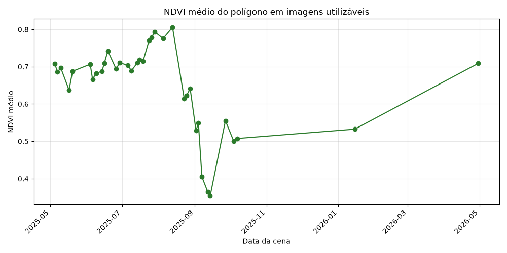

# PoC: NDVI é viável para os piquetes desta fazenda?

**Em MT, há imagem utilizável a cada 5 dias na seca e a cada 53 dias na chuva; o
maior vão é de 105 dias.** Esses números usam o limiar operacional de até 20% de
nuvem, o mesmo aplicado à série de NDVI. No limiar mais estrito de 10%, o maior
vão sobe para 205 dias.

## Recomendação

**Seguir com ressalvas.** O NDVI observado contém um sinal sazonal forte o bastante
para apoiar a leitura de mudança da vegetação, mas a nuvem deixa lacunas longas na
estação chuvosa. Um módulo futuro pode servir para tendência e conferência periódica;
não deve prometer monitoramento contínuo nem alertas rápidos durante a chuva.

NDVI não equivale a matéria seca disponível. Transformar o índice em estimativa de
forragem exige calibração com medições de campo, e esta PoC não fez essa calibração.

## Fonte de dados e acesso

A execução de 1º de agosto de 2026 usou o [Earth Search v1 da Element
84](https://earth-search.aws.element84.com/v1), coleção `sentinel-2-l2a`, e os
COGs Sentinel-2 L2A hospedados no programa de [Dados Abertos da
AWS](https://registry.opendata.aws/sentinel-2-l2a-cogs/).

- Não exige cadastro, plano pago nem chave de API.
- A licença dos dados Sentinel é livre e aberta; o catálogo e os objetos são públicos.
- Não há cota de requisições nem SLA publicados para o endpoint público. Portanto ele é
  adequado à PoC, mas um produto precisaria tratar indisponibilidade e confirmar as
  condições operacionais com o provedor.
- O script faz um `POST` STAC para metadados e leituras HTTP parciais dos COGs. Embora não
  baixe cada cena inteira, tempo e tráfego dependem da rede.

A primeira tentativa usava o Earth Search v0 e a coleção
`sentinel-s2-l2a-cogs`. A própria Element 84 registra que o [v0 foi depreciado e
deixaria de receber itens](https://element84.com/geospatial/introducing-earth-search-v1-new-datasets-now-available/).
Nesse recorte, o v0 retornava somente 56 cenas e terminava em dezembro de 2025, apesar
do período solicitado acabar em abril de 2026. O v1 devolveu os 12 meses completos.

## Área e período

O polígono de teste tem aproximadamente 30 hectares, dentro da faixa de 10–50 ha da
spec, em Mato Grosso:

- `(-55.9000, -13.3000)`
- `(-55.9000, -13.2950)`
- `(-55.8950, -13.2950)`
- `(-55.8950, -13.3000)`

O período é de 2025-05-01 a 2026-04-30. O Sentinel-2 tem revisita global nominal de
cinco dias, equivalente a cerca de 73 oportunidades em um ano. A consulta encontrou
99 cenas em 99 datas distintas; a geometria orbital e a presença de Sentinel-2A, 2B e
2C explicam oportunidades adicionais sobre esse ponto.

## Método

1. A busca STAC coleta `eo:cloud_cover`, data e ativos de cada cena.
2. Os limiares de 10%, 20% e 40% são aplicados antes do cálculo do vão.
3. `largest_gap()` inclui tanto o início até a primeira cena quanto a última cena até
   o fim do período.
4. Nas 36 cenas com até 20% de nuvem, o script lê as bandas vermelha B04 (`red`) e
   infravermelha próxima B08 (`nir`), recorta o polígono e aplica escala/offset do
   metadado STAC.
5. A banda SCL é alinhada aos pixels de 10 m. Nuvem, cirrus, sombra, neve, saturação e
   nodata são removidos; entram apenas as classes de superfície 4, 5, 6 e 7.
6. O NDVI médio usa `(B08 - B04) / (B08 + B04)` somente nos pixels restantes.

`eo:cloud_cover` descreve a cena inteira, não exatamente o polígono. Por isso ele serve
para selecionar candidatos, enquanto a máscara SCL faz o controle local antes do NDVI.

## Disponibilidade das cenas

Foram encontradas 99 cenas. Apertar o limiar agora produz o comportamento esperado:

| Nuvem máxima | Cenas utilizáveis | Maior vão no ano |
|---:|---:|---:|
| 10% | 30 | 205 dias |
| 20% | 36 | 105 dias |
| 40% | 46 | 95 dias |

### Por que o maior vão mudou

O número anterior de 12 dias vinha apenas do maior intervalo **entre** duas cenas; ele
ignorava as bordas. Na série de até 10%, a última cena é 2025-10-07 e não existe outra
até o fim em 2026-04-30: são 205 dias. No limiar de 20%, há cenas em 2026-01-15 e
2026-04-30, reduzindo o maior vão para 105 dias. No de 40%, cenas adicionais reduzem-no
para 95 dias. Assim, 205 ≥ 105 ≥ 95, como a filtragem exige.

### Seca versus chuva

Seca foi definida como maio–setembro e chuva como outubro–abril. “Uma imagem a cada N
dias” é a duração da estação dividida pelo número de cenas utilizáveis nela.

| Nuvem máxima | Cenas na seca | Frequência média na seca | Cenas na chuva | Frequência média na chuva | Maior vão na chuva |
|---:|---:|---:|---:|---:|---:|
| 10% | 28 | 5,5 dias | 2 | 106 dias | 205 dias |
| 20% | 32 | 4,8 dias | 4 | 53 dias | 105 dias |
| 40% | 38 | 4,0 dias | 8 | 26,5 dias | 95 dias |

### Cobertura mensal

| Mês | Cenas | Nuvem média | ≤10% | ≤20% | ≤40% |
|---|---:|---:|---:|---:|---:|
| mai/2025 | 8 | 18,8% | 4 | 5 | 7 |
| jun/2025 | 9 | 15,8% | 6 | 8 | 8 |
| jul/2025 | 9 | 6,0% | 8 | 8 | 8 |
| ago/2025 | 9 | 12,2% | 5 | 5 | 9 |
| set/2025 | 9 | 26,2% | 5 | 6 | 6 |
| out/2025 | 9 | 56,2% | 2 | 2 | 2 |
| nov/2025 | 8 | 74,4% | 0 | 0 | 0 |
| dez/2025 | 10 | 87,3% | 0 | 0 | 0 |
| jan/2026 | 7 | 73,6% | 0 | 1 | 2 |
| fev/2026 | 5 | 79,0% | 0 | 0 | 1 |
| mar/2026 | 8 | 86,4% | 0 | 0 | 0 |
| abr/2026 | 8 | 54,7% | 0 | 1 | 3 |

A versão reproduzível dessa tabela está em [`cloud_cover_monthly.csv`](cloud_cover_monthly.csv).
A cobertura das 99 cenas, sem agregação, está em
[`scene_cloud_cover.csv`](scene_cloud_cover.csv).

## NDVI observado: sinal ou ruído?

O cálculo terminou em **36 de 36 cenas** selecionadas pelo limiar de 20%:

- mínimo: **0,3535**;
- máximo: **0,8055**;
- média: **0,6488**;
- amplitude: **0,4520**.

Não parece apenas ruído. Há uma sequência coerente de perda de vigor: 0,8055 em
13/08, 0,5281 em 02/09, 0,4049 em 07/09 e 0,3535 em 14/09. Depois há recuperação para
0,5551 em 27/09 e 0,7088 em 30/04. Essa amplitude e a persistência por várias cenas são
compatíveis com uma mudança de vegetação que um pecuarista reconheceria visualmente.

A interpretação para aí: sem inspeção do local e medição de campo, a série não distingue
seca do pasto, manejo, fogo, solo exposto, cultivo ou outro uso da área, nem converte NDVI
em massa de forragem. Além disso, novembro, dezembro, fevereiro e março não tiveram
nenhuma cena no limiar de 20%, justamente quando a chuva pode acelerar mudanças.



Os 36 valores, IDs das cenas e coberturas de nuvem estão em
[`ndvi_timeseries.csv`](ndvi_timeseries.csv).

## Reproduzir

```bash
python -m pip install -r poc/ndvi/requirements.txt
python poc/ndvi/demo.py
```

O script gera ou atualiza somente dentro de `poc/ndvi/`:

- `cloud_cover_monthly.csv` — tabela mensal;
- `scene_cloud_cover.csv` — cobertura de nuvem por cena;
- `ndvi_timeseries.csv` — resultados por cena;
- `ndvi_timeseries.png` — gráfico da série efetivamente calculada.

Se nenhuma cena produzir NDVI, o script declara a falha e não gera um gráfico novo com
conteúdo diferente do nome.
